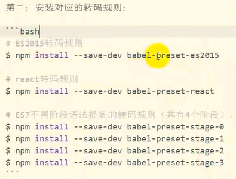

每次写代码都使用babel会降低效率

所以  babel register

1  创建  .babelrc文件

2  安装转码规则

babel-register：实时转码，只适合在开发环境使用，只会对require导入的文件进行转码

- 安装

- 添加傀儡文件
  
  - 文件内容(main.js)
    
    - require('babel-register')
    
    - require('你的核心功能代码入口文件模块')

- node 执行 main.js

babel-core：

babel-node

babel-cli：babel 需转码文件

npm root -g  可以查看全局包安装的目录

本地安装的一些包的命令（比如babel命令）cmd直接使用是不行的只有全局安装的包才能在cmd使用

但是本地安装的包可以配置在package.json文件中就可以通过npm run 来执行

它会自动去node_modules文件中找对应的包的命令执行  "a":"babel demo.js"

所有的工作做完就是要上传到服务器了

- node_modules文件夹不用上传   太大了

- src源码文件也不用上传   已经打包在了dist文件夹

- node_modules的文件，在服务器上再重新安装一遍，因为有package.json文件记录着依赖项

